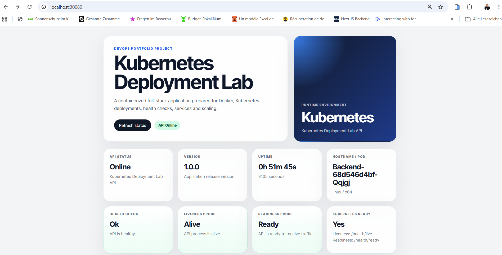
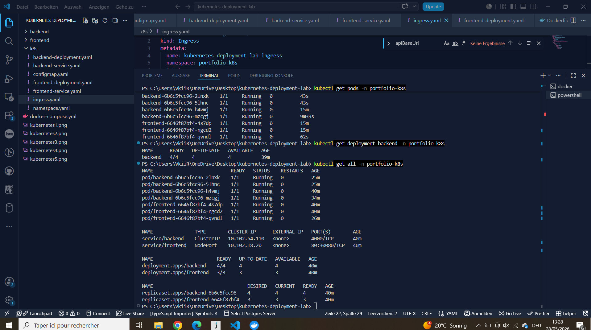
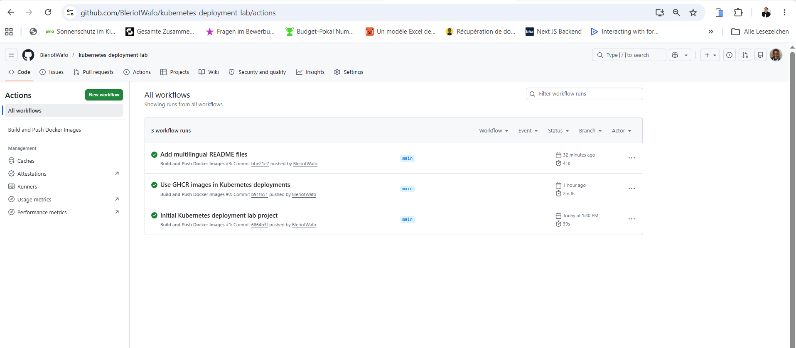

# Kubernetes Deployment Lab

Ein DevOps-Portfolio-Projekt, das zeigt, wie eine Full-Stack-Anwendung mit Docker, Kubernetes und GitHub Actions containerisiert, bereitgestellt, skaliert und überwacht werden kann.

## Sprachen

- [English](README.md)
- [Français](README.fr.md)
- [Deutsch](README.de.md)

---

## Projektübersicht

**Kubernetes Deployment Lab** ist ein Full-Stack-Projekt mit DevOps-Schwerpunkt. Es wurde erstellt, um einen vollständigen Workflow von lokaler Entwicklung über Containerisierung bis hin zur Kubernetes-Orchestrierung zu demonstrieren.

Das Projekt enthält:

- ein Vue.js-Frontend
- eine Node.js / Express Backend-API
- Dockerfiles für Frontend und Backend
- Docker Compose für lokale Container-Tests
- Kubernetes-Manifeste für Deployments, Services und Konfiguration
- Readiness Probes und Liveness Probes
- manuelle Scaling-Tests
- Demonstration des Kubernetes-Self-Healings
- CI/CD-Pipeline mit GitHub Actions
- Docker-Images in der GitHub Container Registry

Ziel des Projekts ist es, praktische DevOps-Kenntnisse in einem klaren, realistischen und portfolio-tauglichen Projekt zu zeigen.

---

## Tech Stack

### Frontend

- Vue.js
- Vite
- Nginx

### Backend

- Node.js
- Express.js
- REST API
- Health-Check-Endpunkte

### DevOps

- Docker
- Docker Compose
- Kubernetes
- GitHub Actions
- GitHub Container Registry
- CI/CD
- Kubernetes Deployments
- Kubernetes Services
- ConfigMaps
- Readiness Probes
- Liveness Probes
- Manuelles Scaling
- Self-Healing

---

## Projektstruktur

```txt
kubernetes-deployment-lab/
├── backend/
│   ├── src/
│   │   ├── app.js
│   │   ├── server.js
│   │   ├── routes/
│   │   └── middleware/
│   ├── Dockerfile
│   ├── package.json
│   └── .dockerignore
│
├── frontend/
│   ├── src/
│   │   ├── App.vue
│   │   ├── main.js
│   │   └── style.css
│   ├── Dockerfile
│   ├── nginx.conf
│   ├── package.json
│   └── .dockerignore
│
├── k8s/
│   ├── namespace.yaml
│   ├── configmap.yaml
│   ├── backend-deployment.yaml
│   ├── backend-service.yaml
│   ├── frontend-deployment.yaml
│   ├── frontend-service.yaml
│   └── ingress.yaml
│
├── .github/
│   └── workflows/
│       └── docker-publish.yml
│
├── docker-compose.yml
├── README.md
├── README.fr.md
└── README.de.md
```

---

## API-Endpunkte

| Methode | Endpoint | Beschreibung |
|---|---|---|
| GET | `/` | Begrüßungsroute der API |
| GET | `/health` | Allgemeiner Health Check |
| GET | `/health/live` | Endpunkt für die Liveness Probe |
| GET | `/health/ready` | Endpunkt für die Readiness Probe |
| GET | `/api/status` | Laufzeitstatus der API |
| GET | `/api/info` | Informationen zum Projekt und Deployment |

---

## Lokale Entwicklung

### Backend starten

```bash
cd backend
npm install
npm run dev
```

Backend:

```txt
http://localhost:4000
```

### Frontend starten

```bash
cd frontend
npm install
npm run dev
```

Frontend:

```txt
http://localhost:5173
```

---

## Start mit Docker Compose

Aus dem Projekt-Hauptverzeichnis:

```bash
docker compose up --build
```

Anwendung:

```txt
http://localhost:8080
```

Nützliche Befehle:

```bash
docker compose down
docker ps
docker logs k8s-lab-backend
docker logs k8s-lab-frontend
```

---

## Docker-Images

Das Projekt veröffentlicht zwei Docker-Images in der GitHub Container Registry:

```txt
ghcr.io/bleriotwafo/kubernetes-deployment-lab-backend:latest
ghcr.io/bleriotwafo/kubernetes-deployment-lab-frontend:latest
```

---

## Kubernetes Deployment

Alle Kubernetes-Manifeste anwenden:

```bash
kubectl apply -f k8s/
```

Ressourcen prüfen:

```bash
kubectl get all -n portfolio-k8s
```

Erwartetes Ergebnis:

```txt
2 Backend Pods
2 Frontend Pods
1 Backend Service
1 Frontend Service
Backend Deployment
Frontend Deployment
```

Zugriff über NodePort:

```txt
http://localhost:30080
```

Alternative mit Port-Forwarding:

```bash
kubectl port-forward service/frontend 8081:80 -n portfolio-k8s
```

Danach öffnen:

```txt
http://localhost:8081
```

---

## Kubernetes Scaling

Backend skalieren:

```bash
kubectl scale deployment backend --replicas=4 -n portfolio-k8s
```

Frontend skalieren:

```bash
kubectl scale deployment frontend --replicas=3 -n portfolio-k8s
```

Pods prüfen:

```bash
kubectl get pods -n portfolio-k8s
```

Zum Standardzustand zurückkehren:

```bash
kubectl scale deployment backend --replicas=2 -n portfolio-k8s
kubectl scale deployment frontend --replicas=2 -n portfolio-k8s
```

---

## Self-Healing-Test

Pods auflisten:

```bash
kubectl get pods -n portfolio-k8s
```

Einen Backend-Pod manuell löschen:

```bash
kubectl delete pod <backend-pod-name> -n portfolio-k8s
```

Kubernetes erstellt automatisch einen neuen Pod, um die gewünschte Anzahl an Replicas beizubehalten.

Verhalten live beobachten:

```bash
kubectl get pods -n portfolio-k8s -w
```

---

## CI/CD-Pipeline

Die GitHub-Actions-Pipeline baut und veröffentlicht die Docker-Images für Backend und Frontend in der GitHub Container Registry.

Workflow-Datei:

```txt
.github/workflows/docker-publish.yml
```

Die Pipeline läuft bei:

- Push auf `main`
- Pull Request nach `main`
- manuellem Workflow-Start

Sie veröffentlicht:

```txt
ghcr.io/bleriotwafo/kubernetes-deployment-lab-backend:latest
ghcr.io/bleriotwafo/kubernetes-deployment-lab-frontend:latest
```

## Screenshots

### Kubernetes Frontend



### Kubernetes Resources



### GitHub Actions Pipeline



---

## Was dieses Projekt zeigt

Dieses Projekt zeigt:

- Entwicklung einer Full-Stack-Anwendung
- Containerisierung mit Docker
- lokale Container-Orchestrierung mit Docker Compose
- Kubernetes Deployments und Services
- Konfigurationsverwaltung mit ConfigMaps
- Readiness Probes und Liveness Probes
- manuelles Skalieren von Workloads
- Kubernetes Self-Healing
- CI/CD mit GitHub Actions
- Veröffentlichung von Docker-Images in GHCR

---


## Autor

Bleriot Wafo